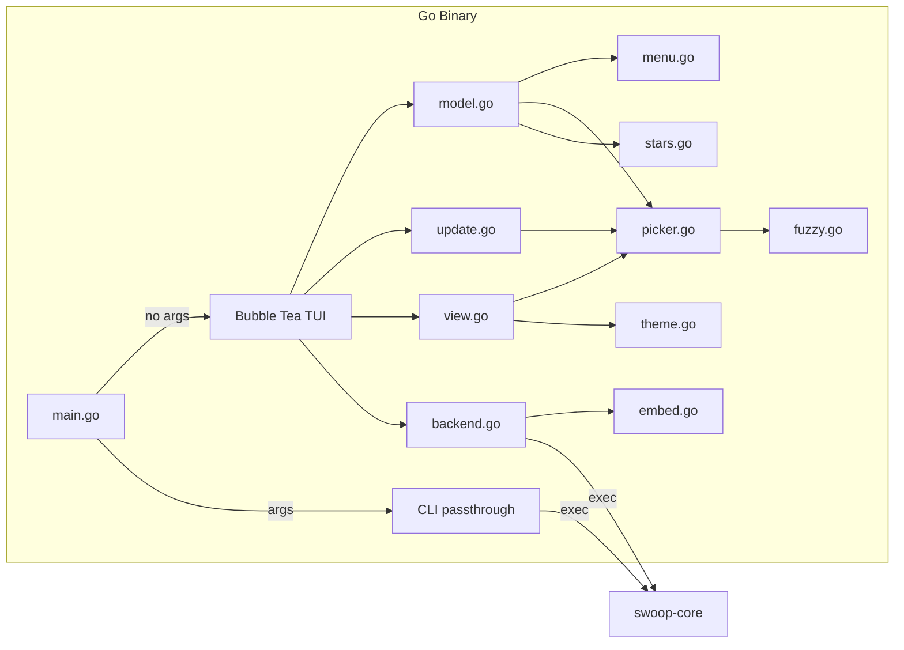
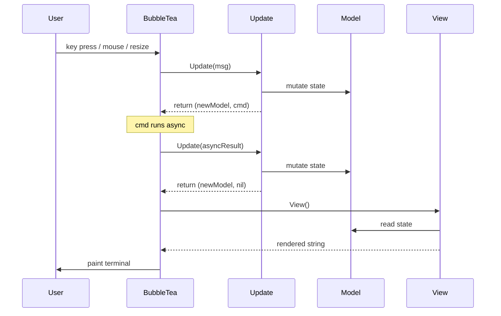
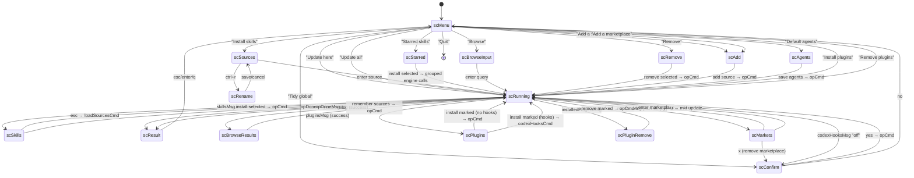

# Architecture: The Go TUI

skillswoop is a single Go binary that presents a Bubble Tea TUI on the front and delegates all real work to an embedded Bash engine. For details on the engine itself, see [ENGINE.md](./ENGINE.md). This doc covers the Go side — the TUI architecture, screen flow, and how each file fits together.

## System diagram



Two modes, decided in `main.go`:
- **No arguments** → Bubble Tea TUI with alt-screen and mouse support
- **Any arguments** → exec the engine directly, piping stdin/stdout/stderr through

## Elm Architecture (Model-Update-View)

The TUI follows Bubble Tea's Elm architecture. Three core files:

| File | Role | Key type/function |
|------|------|-------------------|
| `model.go` | State + message types | `model` struct, `sourcesMsg`, `skillsMsg`, `opDoneMsg`, etc. |
| `update.go` | Message router + key handler | `Update()`, `onKey()` |
| `view.go` | Rendering | `View()`, `buildBody()`, `statusBar()` |

The flow:



**Commands** (async side effects) are the only way to do I/O. They return a `tea.Msg` when done, which feeds back into `Update()`. Key commands:

| Command | What it does | Returns |
|---------|-------------|---------|
| `loadSourcesCmd()` | Read `~/.config/swoop/sources` | `sourcesMsg` |
| `loadSkillsCmd(src)` | Ask engine for skills via `_skills` | `skillsMsg` |
| `loadStarredCmd()` | Read `~/.config/swoop/stars` | `starredMsg` |
| `searchCmd(q)` | Ask engine via `_search` | `searchMsg` |
| `loadMarketsCmd()` | Read `~/.config/swoop/marketplaces` | `marketsMsg` |
| `loadPluginsCmd(src)` | Ask engine for plugins via `_plugins` | `pluginsMsg` |
| `loadInstalledPluginsCmd()` | Ask engine via `_plugins_installed` | `installedPluginsMsg` |
| `codexHooksCmd()` | Ask engine via `_codex_hooks` | `codexHooksMsg` |
| `opCmd(title, args...)` | Run any engine subcommand | `opDoneMsg` |
| `flashFor(text, duration)` | Show a transient status message | `flashMsg` → `clearFlashMsg` |

## Screen state machine

The TUI has 16 screens. `model.screen` is an enum (`scMenu`, `scSources`, etc.) that controls what `View()` renders and what keys `onKey()` responds to.



**The codex hooks round-trip**: installing a hook-flagged plugin with codex targeted parks the install args in `pendingInstall` and fires `_codex_hooks`. If the flag is `off`, `scConfirm` asks whether to enable it — *yes* runs the plain install (the engine auto-enables under `SWOOP_ASSUME_YES`), *no* runs the same install with `--no-hooks-enable` via the optional `denyCmd` hook on `scConfirm` (nil `denyCmd` keeps the old "no = go back" behavior). `on`/`n/a` installs directly.

**The `scRunning → scResult → scMenu` cycle** is the main action loop: every operation goes through a spinner screen, lands on a result screen with scrollable output, then returns to the menu.

## File reference

### `main.go` (44 lines)

Entry point. Parses `--version`, routes to TUI or CLI passthrough. Version is stamped at build time via `-ldflags "-X main.version=..."`.

### `model.go` (156 lines)

The `model` struct holds all TUI state:

```go
type model struct {
    screen screen       // current screen enum
    prev   screen       // previous screen (for back navigation)
    menu   *picker      // main menu picker
    pick   *picker      // active picker for sub-screens
    input  textinput.Model
    spin   spinner.Model
    vp     viewport.Model
    global bool         // project vs global scope toggle
    curSource string    // source being drilled into
    filtering bool      // slash-filter mode in the repo skills picker
    // ... result/confirm state, flash message, agents
}
```

Also defines all message types (`sourcesMsg`, `skillsMsg`, `opDoneMsg`, etc.) and command constructors (`loadSourcesCmd`, `opCmd`, etc.).

### `update.go` (548 lines — largest file)

The `Update()` method is the central message router. It handles:

1. **`tea.WindowSizeMsg`** — recalculate layout, init viewport
2. **`spinner.TickMsg`** — animate spinner
3. **`flashMsg` / `clearFlashMsg`** — transient status text
4. **`sourcesMsg` / `skillsMsg` / `searchMsg`** — populate pickers from engine data
5. **`opDoneMsg`** — show result screen with engine output
6. **`tea.MouseMsg`** — scroll in result viewport or lists
7. **`tea.KeyMsg`** → delegates to `onKey()`

`onKey()` is a large switch on `m.screen` + key string. Each screen has its own key bindings. Global keys: `ctrl+c` = quit.

Layout math lives in `layout()` — calculates `innerW`/`innerH` accounting for header, borders, status bar.

### `view.go` (173 lines)

`View()` builds the full terminal output: header (gradient banner) → panel (body) → status bar.

`buildBody()` switches on `m.screen` and renders each screen using:
- `picker.view()` for list screens
- `input.View()` for input screens
- `vp.View()` for the result viewport
- `spin.View()` for the running spinner

`statusBar()` renders a two-column footer: key hints + scope + agents.

### `menu.go` (185 lines)

Defines the 13 main menu entries as `menuEntry` structs, each with an `act` function that returns a `(tea.Model, tea.Cmd)`. Also contains `installSelected()` which builds the engine command from marked skills, and `installSelectedPlugins()` which does the same for marked plugins (detouring through the codex hooks check when needed).

### `picker.go` (305 lines)

A self-contained, windowed, optionally multi-select list widget. Handles:

- **Virtual scrolling**: `top`/`cursor`/`height` math in `clampWindow()` — the cursor never leaves the visible window
- **Multi-select**: `toggle()`, `selectAll()`, `selected()`, `selectedCount()`
- **Fuzzy filtering**: keeps all rows as backing state and filters visible indexes so marks and stars survive filtering
- **Two-column rendering**: titles padded to `titleW` so descriptions align
- **Component badges**: plugin rows with `hooks`/`mcp` in `item.flags` get dim `[hooks]` `[mcp]` badges between title and description (dropped when the row is too narrow)
- **Scroll indicators**: `scrollFooter()` shows `▲ 3/29 ▼` + marked count

The picker is reused for every list: menu, sources, skills, browse results, remove, marketplaces, plugins.

### `backend.go` (255 lines)

The bridge to the engine:

| Function | What it does |
|----------|-------------|
| `corePath()` | Resolve engine path: `SWOOP_CORE` env → cache → sibling → `"swoop-core"` |
| `core(args...)` | Run engine, return combined stdout+stderr |
| `loadSources()` / `loadProjects()` / `loadAgents()` | Read config files |
| `loadAliases()` / `saveAlias()` | Read/write source display names |
| `sourceItems()` | Build source list with aliases applied |
| Star helpers (`stars.go`) | Read/write starred source/skill pairs |
| `listSkills(src)` | Call `_skills`, parse tab-separated output |
| `searchSkills(q)` | Call `_search`, parse tab-separated output |
| `loadMarketplaces()` / `marketItems()` | Read `~/.config/swoop/marketplaces` (3-column TSV) |
| `listPlugins(src)` / `parsePlugins()` | Call `_plugins`, parse header + `name<TAB>desc<TAB>flags` |
| `listInstalledPlugins()` | Call `_plugins_installed`, parse merged plugin list |
| `codexHooksState()` | Call `_codex_hooks` → `on`/`off`/`n/a` |

Also contains `stripANSI()` (regex to remove ANSI escape codes) and config path helpers.

### `stars.go` (118 lines)

Manages starred source/skill pairs — skills the user has marked for quick reuse. Stores them in `~/.config/swoop/stars` as `source<TAB>skill<TAB>description` lines. Used by the Starred Skills menu entry, which groups starred skills by source and installs them in batched engine calls.

### `fuzzy.go` (88 lines)

Slash-filter mode for the skills picker. When the user types `/query`, the picker switches from normal scrolling to fuzzy-filtered view. Keeps all rows as backing state and filters visible indexes, so marks and selections survive filtering.

### `theme.go` (156 lines)

Cyberpunk visual style. Defines:

- **11 named colors** (`cPink`, `cCyan`, `cPurple`, etc.)
- **24 Lipgloss styles** (`panelStyle`, `rowCursor`, `checkOn`, `errStyle`, etc.)
- **Gradient system**: `gradStops` (pink → purple → cyan), `colorAt()`, `gradient()` for per-rune color interpolation
- **Banner**: `banner()` renders the gradient wordmark + tagline + rule
- **Utility**: `truncate()`, `padRight()`, `padLines()` for layout math

### `embed.go` (40 lines)

Embeds `engine/swoop-core` into the binary via `go:embed`. `extractedCore()` writes it to the cache dir with a content-hash filename (first 8 hex chars of SHA-256). If the file already exists (same hash), it skips the write.

## The picker in action

Since the picker drives most of the UX, here's how it renders:

```
▌ ◉ diagnose            Disciplined diagnosis loop for hard bugs…
  ○ tdd                 Test-driven development with a red-green-…
  ◉ grill-with-docs     Grilling session that challenges your pl…
  ○ to-issues           Break a plan into independently-grabbabl…
▲ 2/29 ▼   ◉ 2 marked
```

- `▌` = cursor bar (only on the focused row)
- `◉`/`○` = checked/unchecked (only in multi-select mode)
- Titles are padded to a shared column width so descriptions align
- `▲`/`▼` appear when the list is scrolled

## Build

```sh
go build -o swoop .
# with version:
go build -ldflags "-X main.version=1.2.3" -o swoop .
```

No build tags, no CGO, no special flags beyond the optional version stamp. The `go:embed` directive pulls in `engine/swoop-core` at compile time.

## Testing

Six test files cover the main code paths:

| File | What it tests |
|------|---------------|
| `render_test.go` | Smoke test: walks screens (menu, skills, running, result, add) calling `View()` to verify nothing panics |
| `update_test.go` | Tests for the `Update()` message router |
| `backend_test.go` | Tests for engine bridge functions |
| `engine_test.go` | Tests for engine integration |
| `fuzzy_test.go` | Tests for the slash-filter mode |
| `stars_test.go` | Tests for starred skills read/write |
