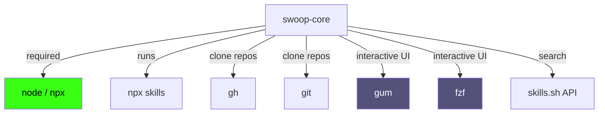
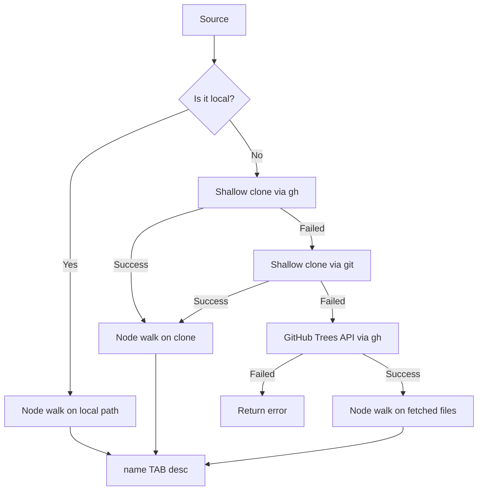
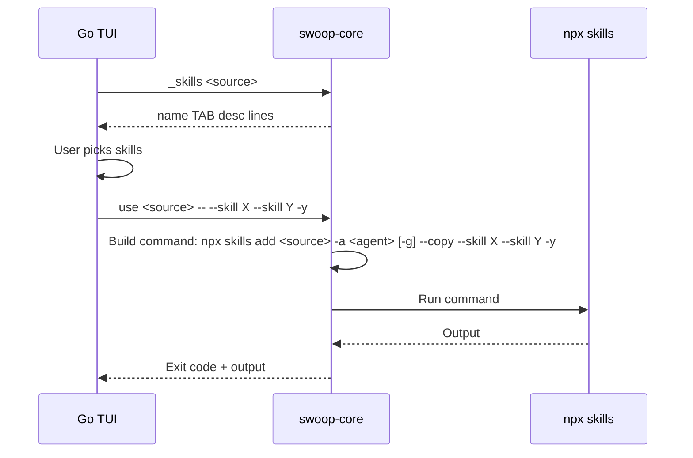

# The Bash Engine (`swoop-core`)

`swoop-core` is a ~1000-line Bash script that does all the real work in skillswoop: cloning repos, listing skills, running `npx skills`, and managing config. The Go binary is just a TUI shell that delegates to this script.

### What is a "skill"?

A skill is a directory containing a `SKILL.md` file with YAML frontmatter (`name`, `description`) and Markdown instructions. Claude Code and Codex load these from their skill directories (e.g., `.claude/skills/<name>/`). The `npx skills` CLI (from [vercel-labs/skills](https://github.com/vercel-labs/skills)) handles fetching and placing them into the right agent directories.

## How it runs

The script lives at `engine/swoop-core` in the repo. It's embedded into the Go binary via `go:embed`. On first run, `embed.go` extracts it to the user's cache (`~/Library/Caches/swoop/swoop-core-<sha256-prefix>`) and exec's it from there. The hash ensures a new binary release replaces the old engine.

You can override this with `SWOOP_CORE=/path/to/swoop-core` during development.

The engine is invoked two ways:

```
swoop-core                     # interactive menu (gum/fzf/numbered)
swoop-core <subcommand> [args] # non-interactive, driven by the TUI or CLI
```

## Subcommands

| Command | Signature | What it does |
|---------|-----------|--------------|
| `menu` | (no args) | Interactive home screen. Loops until "Quit". |
| `add` | `add <source>...` | Remember one or more sources. Local paths get copied into the library. |
| `use` | `use <source>... [-- args]` | Install skills from a source. Without `--`, shows an interactive picker. With `-- --skill X --skill Y -y`, installs specific skills non-interactively. |
| `update` | `update [--all] [skill...]` | Refresh installed skills from GitHub. `--all` walks every known project dir. |
| `browse` | `browse [query]` | Search skills.sh. Shows results, lets you remember/install repos. |
| `stars` | (no args) | Print starred skills as `source<TAB>skill<TAB>description`. |
| `star` | `star <source> <skill>...` | Validate and remember source/skill pairs for quick reuse. |
| `unstar` | `unstar <source> <skill>...` | Remove starred source/skill pairs. |
| `list` | (no args) | Print saved sources, agents, and scope. |
| `remove` | `remove [source]...` | Remove saved sources. Interactive picker if no args. |
| `agents` | `agents [name]...` | Print or set default target agents. Default: `claude-code codex`. |
| `stash` | (no args) | Move global skills out of `~/.claude/skills` etc. into the library. One-time declutter. |
| `mkt` | `mkt add <source>... \| list \| remove <source>... \| update` | Manage plugin marketplaces. `add` detects which manifest format(s) a repo provides, registers it with each compatible agent's native CLI (`claude plugin marketplace add` / `codex plugin marketplace add`), warns about skipped agents, and caches the marketplace names. `update` runs `claude plugin marketplace update` + `codex plugin marketplace upgrade`. |
| `plugin` | `plugin install <source> <plugin>... \| list \| remove <plugin[@marketplace]>...` | Install/list/remove plugins via the native CLIs. Unknown source on install offers `mkt add` first. |
| `_skills` | `_skills <source>` | Machine-readable: print `name<TAB>desc` for each skill in a source. Used by the TUI. |
| `_search` | `_search [query]` | Machine-readable: search skills.sh, print `source<TAB>name<TAB>installs`. Used by the TUI. |
| `_sources` | `_sources` | Machine-readable: print saved sources. (Engine has it; TUI reads the file directly instead.) |
| `_projects` | `_projects` | Machine-readable: print known project dirs. (Engine has it; TUI reads the file directly instead.) |
| `_mkts` | `_mkts` | Machine-readable: dump the marketplaces file. (Engine has it; TUI reads the file directly instead.) |
| `_plugins` | `_plugins <source>` | Machine-readable: print an `@marketplace<TAB>claude_name<TAB>codex_name` header, then `name<TAB>desc<TAB>flags<TAB>relpath` per plugin (flags: `claude,codex,hooks,mcp,commands,agents,skills`; relpath = repo-local plugin dir, empty for external sources). Used by the TUI. |
| `_plugins_installed` | `_plugins_installed` | Machine-readable: merge `claude plugin list --json` + `codex plugin list --json` into `name@marketplace<TAB>agents<TAB>desc`. Tolerates either CLI missing (warns on stderr). |
| `_codex_hooks` | `_codex_hooks` | Machine-readable: print the codex `features.hooks` state — `on`, `off`, or `n/a`. Any parse failure is `n/a`; it never blocks installs. |

Flags that apply anywhere:

| Flag | Effect |
|------|--------|
| `-g` / `--global` | Target global agent dirs (`~/.claude/skills`) instead of project-local (`./.claude/skills`) |
| `--link` | Symlink skills instead of copying |
| `--no-copy` | Don't copy local skills into the library on `add` |
| `--dry-run` | Print what would run instead of running it |
| `--no-hooks-enable` | On `plugin install`, never toggle codex `features.hooks` (skip the enable prompt) |
| `--` | Everything after `--` is passed to `npx skills` |

Aliases: `save`=`add`, `install`=`use`, `upgrade`=`update`, `rm`=`remove`, `ls`=`list`, `migrate`=`stash`, `marketplace`=`mkt`, `plugins`=`plugin`.

## File layout

```
~/.config/swoop/
  sources          One URL/path per line — remembered skill sources
  agents           One agent name per line (default: claude-code + codex)
  projects         One absolute path per line — dirs skills were installed into
  aliases          url<TAB>alias per line — display names (TUI only)
  stars            source<TAB>skill<TAB>description — starred skills for reuse
  marketplaces     source<TAB>claude_name<TAB>codex_name — plugin marketplaces
                   (names cached from each format's marketplace.json at add time;
                   empty column = that format is absent from the repo)

~/.local/share/swoop/
  library/         Skills copied here by `add` (local) or `stash` (global tidy)

<project>/
  skills-lock.json Written by `npx skills` — tracks what's installed + source hashes
  .claude/skills/  Claude Code skills (project scope)
  .agents/skills/  Codex skills (project scope)

~/.claude/skills/  Claude Code skills (global scope)
~/.codex/skills/   Codex skills (global scope)
```

Migration: on first run, if `~/.config/swoop` doesn't exist but `~/.config/ccskill` does, it's copied over (the project's old name).

## Scope model

Two scopes, toggled by `-g`:

- **Project** (default): Skills land in `<cwd>/.claude/skills/` etc. The current directory is recorded in `projects` so `update --all` can find it later.
- **Global**: Skills land in `~/.claude/skills/` etc. Not tracked in `projects`.

The engine pre-creates the agent skill directories in project scope so `npx skills -y` doesn't fall back to global.

## Environment variables

| Variable | Default | What it does |
|----------|---------|--------------|
| `SWOOP_DEBUG` | (unset) | `set -x` tracing + stderr instead of `/dev/null` |
| `SWOOP_CORE` | (embedded) | Path to the engine script (dev override) |
| `SWOOP_ASSUME_YES` | (unset) | Skip all `ui_confirm` prompts. Set by the Go TUI. |
| `SWOOP_DRYRUN` | (unset) | Same as `--dry-run` flag |
| `SWOOP_SKILLS_CMD` | `npx --yes skills` | Override the skills CLI command |
| `SWOOP_SEARCH_API` | `https://skills.sh` | Override the search API endpoint |
| `NO_COLOR` | (unset) | Strip ANSI colors from output. Set by the Go TUI for `core()`. |

## External dependencies



- **`node`/`npx`** — Required. Runs the `skills` CLI and the inline Node scripts for skill walking and search.
- **`gh`** — Used to clone repos (handles private repos via auth). Falls back to plain `git` for public repos. Also used for the GitHub Trees API path (no-clone skill listing).
- **`git`** — Fallback for cloning when `gh` isn't available.
- **`gum`** — Best interactive UI. If missing, falls back to `fzf`, then to a plain numbered prompt.
- **`fzf`** — Second-best interactive UI.

## How skill discovery works

Listing skills for a source means finding every `SKILL.md` and extracting its `name` and `description` from the YAML frontmatter. The engine tries three strategies in order:



1. **Local path** — Run the inline Node walker directly on the directory.
2. **Shallow clone** — `gh repo clone --depth 1` (or `git clone --depth 1` as fallback), then walk the clone.
3. **GitHub Trees API** — If no clone tool is available, enumerate `SKILL.md` paths via `gh api repos/<slug>/git/trees`, fetch only those files, then walk them. No full clone needed.

The Node walker (`NODE_WALK`) is an inline script that recursively walks a directory, parses `SKILL.md` YAML frontmatter, and prints `name<TAB>description` lines.

## How install works



The engine doesn't install skills itself — it builds the right `npx skills add` invocation:

1. Loads agents from config (default: `claude-code codex`)
2. Adds `-a <agent>` for each one
3. Adds `-g` if global scope
4. In project scope, pre-creates agent skill dirs so `npx skills` doesn't auto-escalate to global
5. Adds `--copy` (or omits if `--link`)
6. Appends anything after `--`
7. Records the project dir in `projects` for `update --all`

## How update works

- **Single dir** (`update`): Runs `npx skills update -p -y` in the current directory (or `-g` for global). Requires a `skills-lock.json` to exist.
- **All dirs** (`update --all`): Reads `~/.config/swoop/projects`, iterates each dir, runs `npx skills update -p -y` inside it. Prunes entries where the dir is gone or has no `skills-lock.json`.

## How plugins work

Plugins are bundles (skills + hooks + MCP servers + Claude-only commands/agents) distributed through marketplace repos. Unlike skills, the engine never places files itself — it drives each agent's native plugin CLI, which also auto-wires any bundled hooks on install.

A marketplace repo can carry two manifest formats:

- `.claude-plugin/marketplace.json` — Claude Code
- `.agents/plugins/marketplace.json` — Codex

`mkt add` reads both (via the inline `NODE_PLUGINS` parser on a shallow clone or local path), registers the repo with each agent whose format exists, and warns clearly about the ones it skipped. The `name` field from each manifest is cached in the `marketplaces` file so later installs/removals know what name each CLI registered.

**Scope mapping** on `plugin install`:

- **Claude Code**: project scope (default) → `claude plugin install <p>@<mkt> --scope project`; `-g` → `--scope user`.
- **Codex, `-g`**: `codex plugin add <p>@<mkt>` (user-wide, via the registered marketplace).
- **Codex, project scope**: the plugin is **vendored into the repo** — its source directory is copied to `./plugins/<name>/` and registered in `./.agents/plugins/marketplace.json` (`"source": {"source":"local","path":"./plugins/<name>"}`), which Codex auto-discovers when running inside the project. Installing/enabling remains a Codex action: the engine prints reminders to open `/plugins` inside Codex (and `/hooks` to trust bundled hooks). Vendoring requires the plugin's source to live inside the marketplace repo; external-repo plugin sources get a warning suggesting `-g`. `plugin remove` in project scope deletes `./plugins/<name>` and drops its marketplace entry.

**Codex hooks**: before installing a hook-flagged plugin for codex, if `_codex_hooks` reports `off` the engine asks to run `codex features enable hooks` (auto-yes under `SWOOP_ASSUME_YES`; suppressed entirely by `--no-hooks-enable`). Declining continues the install with a warning that the plugin's hooks won't run.

**Hooks/mcp detection caveat**: component flags are exact for plugins whose `source` is a repo-local path — string form (`"./plugins/x"`) or object form (`{"source":"local","path":"./plugins/x"}`) — where the engine inspects the directory for `hooks/hooks.json`, `.mcp.json`, `commands/`, `agents/`, `skills/` and the plugin manifest keys (`.claude-plugin/plugin.json`, `.codex-plugin/plugin.json`, or `plugin.json`). For plugins hosted in *external* repos, only what the marketplace entry itself declares is badged — no second clone is made.

## TUI integration

The Go binary calls the engine through `core()` in `backend.go`:

```go
cmd.Env = append(os.Environ(), "NO_COLOR=1", "SWOOP_ASSUME_YES=1")
```

- **`NO_COLOR=1`** — Strips ANSI from engine output so the TUI result pane is clean.
- **`SWOOP_ASSUME_YES=1`** — Skips the engine's own `ui_confirm` prompts; the TUI handles confirmation in its own screens.

The TUI uses the machine-readable commands for data, then drives user-facing commands for actions:

| TUI screen | Engine call |
|------------|-------------|
| Sources list | (reads `~/.config/swoop/sources` directly via `loadSources()`) |
| Skills picker | `_skills <source>` |
| Starred picker | `~/.config/swoop/stars`, then grouped `use <source> -- --skill ...` installs |
| Search | `_search <query>` |
| Install | `use <source> -- --skill X -y` |
| Update | `update` / `update --all` |
| Add source | `add <source>` |
| Remove | `remove <source>...` |
| Browse results | `browse <query>` → remembers + installs |
| Tidy global | `stash` |
| Set agents | `agents <names>...` |
| Marketplace list | (reads `~/.config/swoop/marketplaces` directly via `loadMarketplaces()`) |
| Plugins picker | `_plugins <source>` |
| Install plugins | `_codex_hooks` (when a marked plugin has hooks), then `plugin install <mkt> <p>... [--no-hooks-enable]` |
| Add marketplace | `mkt add <source>` |
| Remove marketplace / update | `mkt remove <source>` / `mkt update` |
| Remove plugins | `_plugins_installed`, then `plugin remove <p@mkt>...` |

CLI passthrough (`swoop use ...`) goes straight to the engine with no `NO_COLOR` or `SWOOP_ASSUME_YES` — it talks directly to the terminal.

## Debugging

Set `SWOOP_DEBUG=1` to get:

- `set -x` trace of every command the engine runs
- Errors logged to stderr instead of `/dev/null`
- Full clone/API error output that's normally suppressed

Common failure modes:

| Symptom | Cause | Fix |
|---------|-------|-----|
| "Couldn't list individual skills" | Clone failed + API fallback failed | `SWOOP_DEBUG=1 swoop _skills <source>` to see why |
| `npx skills` installs to global instead of project | Agent dirs don't exist yet | Engine pre-creates them, but check `SWOOP_DEBUG` output |
| Search returns nothing | Network issue or `skills.sh` down | Check `SWOOP_SEARCH_API` override |
| Engine not found | Cache dir missing or binary corrupt | Delete `~/Library/Caches/swoop/` and re-run |
| `ccskill` config not migrated | Migration runs once; if it failed, copy `~/.config/ccskill` → `~/.config/swoop` manually |
